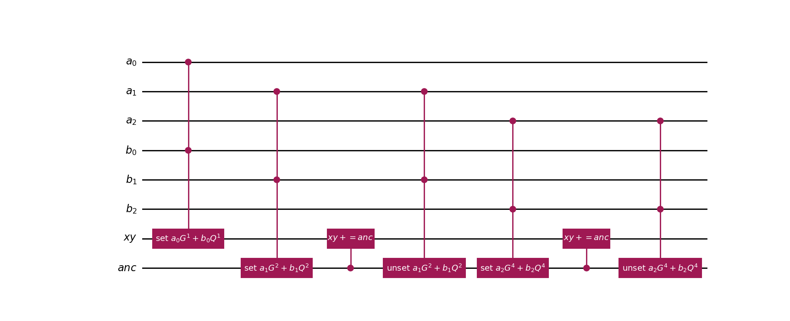
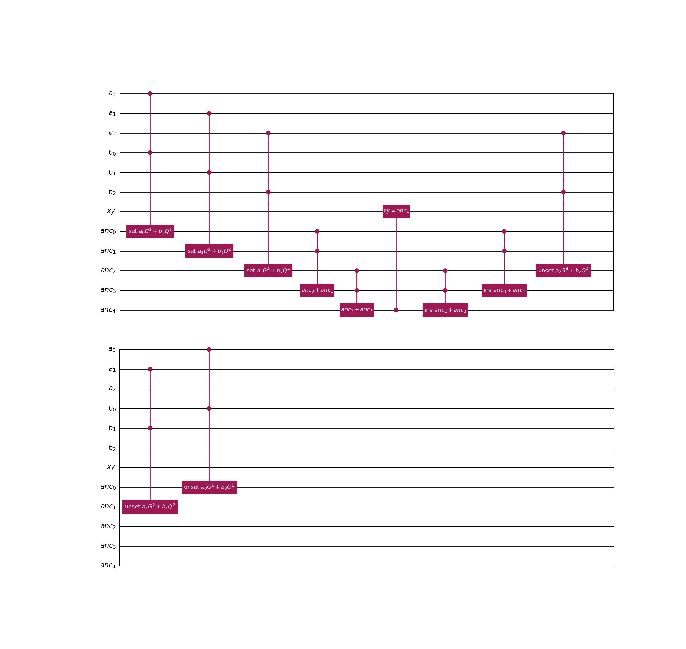

# 量子回路の詳細

ショアのアルゴリズムを利用した量子回路の全体像を以下に示す。

```
       ┌───┐                         ░ ┌──────┐┌─┐   
   qa: ┤ H ├────────■────────────────░─┤ QFT† ├┤M├───
       ├───┤        │                ░ ├──────┤└╥┘┌─┐
   qb: ┤ H ├────────■────────────────░─┤ QFT† ├─╫─┤M├
       └───┘┌───────┴────────┐┌─┐    ░ └──────┘ ║ └╥┘
   qx: ─────┤0               ├┤M├────░──────────╫──╫─
            │                │└╥┘┌─┐ ░          ║  ║ 
   qy: ─────┤1               ├─╫─┤M├─░──────────╫──╫─
            │  oracle: aG+bQ │ ║ └╥┘ ░          ║  ║ 
anc_0: ─────┤2               ├─╫──╫──░──────────╫──╫─
            │                │ ║  ║  ░          ║  ║ 
anc_1: ─────┤3               ├─╫──╫──░──────────╫──╫─
            └────────────────┘ ║  ║  ░          ║  ║ 
  a: 1/════════════════════════╬══╬═════════════╩══╬═
                               ║  ║             0  ║ 
  b: 1/════════════════════════╬══╬════════════════╩═
                               ║  ║                0 
 xy: 2/════════════════════════╩══╩══════════════════
                               0  1                  
```

この量子回路の中心となる $aG+bQ$ について 8bit の場合を例に説明する。

$a=\ket{a_7a_6...a_0}, b=\ket{b_7b_6...b_0}$の量子ビットで表現すると$aG+bQ$は以下となる。

```math
aG+bQ=\ket{a_7}G^{2^7}+\ket{a_6}G^{2^6}+...+\ket{a_0}G+\ket{b_7}Q^{2^7}+\ket{b_6}Q^{2^6}+...+\ket{b_0}Q
```

このように、分解した座標同士の足し算（点加算）を繰り返すことで $aG+bQ$ の重ね合わせ状態を作成できる。  
この式では、合計15回の点加算が行われている。

点加算は非常に複雑な量子回路となるため、その実行回数を削減するために、Version3では以下のように計算を行った。

```math
aG+bQ=\ket{a_7b_7}f(a_7,b_7)+\ket{a_6b_6}f_2(a_6,b_6)+...\ket{a_0b_0}f(a_0,b_0)
```

古典計算で $f(a_i,b_i)=\ket{a_i}G^{2^i}+\ket{b_i}G^{2^i}$ （4つの座標の重ね合わせ）を計算して量子レジスタに設定することで、量子回路による点加算を7回に削減している。

今回のVersion4では、量子回路による点加算をさらに削減すべく、以下の計算を行っている。

```math
\begin{aligned}
aG + bQ =\;&
\ket{a_1 a_2 a_3} g_3(a_1,a_2,a_3)
+ \ket{a_4 a_5 a_6} g_3(a_4,a_5,a_6)
+ \ket{a_0 a_7} g_2(a_0,a_7) \\
&\quad
+ \ket{b_1 b_2 b_3} q_3(b_1,b_2,b_3)
+ \ket{b_4 b_5 b_6} q_3(b_4,b_5,b_6)
+ \ket{b_0 b_7} q_2(b_0,b_7)
\end{aligned}
```

上記で登場する関数は、古典計算で以下の重ね合わせ状態を作成し、量子レジスタへ設定している。

```math
\begin{aligned}
g_3(a_i,a_j,a_k)&=\ket{a_i}G^{2^i}+\ket{a_j}G^{2^j}+\ket{a_k}G^{2^k} \\
g_2(a_i,a_j)&=\ket{a_i}G^{2^i}+\ket{a_j}G^{2^j} \\
q_3(b_i,b_j,b_k)&=\ket{b_i}Q^{2^i}+\ket{b_j}Q^{2^j}+\ket{b_k}Q^{2^k} \\
q_2(b_i,b_j)&=\ket{b_i}Q^{2^i}+\ket{b_j}Q^{2^j}
\end{aligned}
```

これによって点加算は5回に削減されている。

さらなる工夫として、点加算を複雑にしている分岐条件（同一座標の点倍算、逆元による加算でOになる）が不要となる場合は別の量子回路構造としている。

```math
\begin{aligned}
add_{normal}&:\ket{a_1 a_2 a_3} g_3(a_1,a_2,a_3)
+ \ket{a_4 a_5 a_6} g_3(a_4,a_5,a_6) \\
add_{nodbl}&:\ket{a_1a_2...a_6}g_6(a_1,a_2,...,a_6)+\ket{a_0a_7}g_2(a_0,a_7)
\end{aligned}
```

$aG$の重ね合わせを作成する段階では、点倍算も逆元の加算も発生しない$add_{normal}$と、逆元の加算はあるものの点倍算が発生しない$add_{nodbl}$を用意することで、量子ゲート数の削減を実現している。  
この考え方は同様に $bQ$ の重ね合わせを作成する際にも利用できる。

## 2種類の量子回路

本プログラムでは、量子回路は深くなるものの量子ビット数を抑えたcompact版と、量子ビット数は増えるものの量子回路を浅くした wide 版を実装している。

- compact版
  - 以下のように1回の点加算を終えるたびに uncompute している

  - 1回の点加算分の量子ビット数で実現できる
  - 量子ビット数がメモリ使用量に影響するシミュレータで効果的
- wide版
  - 以下のように全てのECC足し算を行った後、uncompute している

  - 結果として、点加算の回数に比例して量子ビット数が必要となる
  - 量子コンピュータの実機で効果的

現在の量子コンピュータでは、どちらの方式でもエラーにより期待する値は測定できなかったものの、
将来的に量子コンピュータの性能が上がることで、いずれかの方式で正しく動作できることを期待している。

## ECC足し算の量子回路

ECC足し算は非常に複雑な量子回路となる。  
3つのECC座標 $xx, yy, zz$ において $\ket{xx}+\ket{yy} \mapsto \ket{zz}$ となる量子回路を、以下の量子レジスタの構成で実現した。

```math
\ket{xx}\ket{yy}\ket{zz}\ket{ancilla}
```

各量子レジスタは、さらに分解すると以下の構成となっている。

```math
\begin{align*}
\ket{xx} &= \ket{y_1,x_1} \\
\ket{yy} &= \ket{y_2,x_2} \\
\ket{zz} &= \ket{y_3,x_3} \\
\ket{ancilla} &= \ket{f_1,f_2,f_3,f_4,carry,\lambda,a_1,a_2}
\end{align*}
```

**ancillaの詳細**
- $f_1$: $(x_1, y_1)=O$を示すフラグ
- $f_2$: $(x_2, y_2)=O$を示すフラグ
- $f_3$: $(x_1, y_1)+(x_2, y_2)=O$を示すフラグ
- $f_4$: $(x_1, y_1)=(x_2, y_2)$を示すフラグ（同一座標の足し算）
- $carry$: 各種計算で利用するキャリービット
- $\lambda$: ECC足し算の計算途中で登場する $\lambda=\frac{y_2-y_1}{x_2-x_1} or \frac{3x_1^2+a}{2y_1}$ の値を保持する量子レジスタ
- $a_1$: $(x_1,y_1)+(x_2,y_2)=O$ の判定で利用するY座標計算用
- $a_2$: $\lambda$の分母を $\frac{1}{x} = x^{-1} \mod p$の剰余逆元へ計算するための量子レジスタ

Version3以降では、上記レジスタを用いて効率的に計算したことで、大幅に量子ゲート数を削減することに成功した。  
以下にその計算過程を示す。

|対象レジスタ|制御ビット|量子操作|変化後の値|備考|
|---|---|---|---|---|
|$f_1$|$y_1,x_1$|$\ket{0} \mapsto \ket{1}, \text{if}(x_1=0,y_1=0)$|$\begin{cases}\ket{1}, & \text{if}(x_1=0,y_1=0) \\ \ket{0},& \text{otherwise}\end{cases}$|$(x_1,y_1)=O$のフラグを設定|
|$f_2$|$y_2,x_2$|$\ket{0} \mapsto \ket{1}, \text{if}(x_2=0,y_2=0) $|$\begin{cases}\ket{1}, & \text{if}(x_2=0,y_2=0) \\ \ket{0},& \text{otherwise}\end{cases}$|$(x_2,y_2)=O$のフラグを設定|
|$x_3$|$f_1, f_2, x_1, x_2$|$\ket{0} \mapsto \begin{cases} \ket{x_2}, & \text{if}(f_1=1) \\ \ket{x_1}, & \text{if}(f_2=1) \\ \end{cases}$|$\begin{cases} \ket{x_2}, & \text{if}(f_1=1) \\ \ket{x_1}, & \text{if}(f_2=1) \\ \ket{0}, & \text{otherwise}\end{cases}$|$(x_1,y_1),(x_2,y_2)$のいずれかが$O$の場合に$x_3$を決定|
|$y_3$|$f_1, f_2, y_1, y_2$|$\ket{0} \mapsto \begin{cases} \ket{y_2}, & \text{if}(f_1=1) \\ \ket{y_1}, & \text{if}(f_2=1) \end{cases}$|$\begin{cases} \ket{y_2}, & \text{if}(f_1=1) \\ \ket{y_1}, & \text{if}(f_2=1) \\ \ket{0}, & \text{otherwise}\end{cases}$|$(x_1,y_1),(x_2,y_2)$のいずれかが$O$の場合に$y_3$を決定|
|$x_3$|$f_1,x_2$|$\ket{0} \mapsto \ket{-x_2 \mod p}, \text{if}(f_1 = 0)$|$\begin{cases} \ket{x_2}, & \text{if}(f_1=1) \\ \ket{x_1}, & \text{if}(f_2=1) \\ \ket{-x_2 \mod p}, & \text{otherwise}\end{cases}$|$x_3=\lambda^2-x_1-x_2$の $-x_2$の項を計算|
|$x_2$|$x_1$|$\ket{x_2} \mapsto \ket{x_2-x_1 \mod p}$|$\ket{x_2-x_1 \mod p}$|$\lambda$の分母を計算|
|$a_1$|$y_1, y_2$|$\ket{0} \mapsto \ket{y_1+y_2-p}$|$\ket{y_1+y_2-p}$|$(x_1,y_1)+(x_2,y_2)=O$の判定用|
|$y_2$|$y_1$|$\ket{y_2} \mapsto \ket{y_2-y_1 \mod p}$|$\ket{y_2-y_1 \mod p}$|$\lambda$の分子を計算|
|$f_3$|$x_2,a_1$|$\ket{0} \mapsto \ket{1}, \text{if}(x_2=0, a_1=0)$|$\begin{cases} \ket{1}, & \text{if}(x_1=x_2, y_1+y_2=p) \\ \ket{0} , & \text{otherwise} \end{cases}$|$(x_1,y_1)+(x_2,y_2)=O$のフラグを設定|
|$f_4$|$x_2,y_2$|$\ket{0} \mapsto \ket{1}, \text{if}(x_2=0,y_2=0)$|$\begin{cases} \ket{1}, & \text{if}(x_1=x_2,y_1=y_2) \\ \ket{0}, & \text{otherwise} \end{cases}$|同一座標フラグを設定|
|$x_3$|$f_3, x_1$|$\ket{x_3} \mapsto \ket{x_3+x_1} ,\text{if}(f_3=1)$|$\begin{cases} \ket{x_2}, & \text{if}(f_1=1) \\ \ket{x_1}, & \text{if}(f_2=1) \\ \ket{0}, & \text{if}(f_3=1) \\ \ket{-x_2 \mod p}, & \text{otherwise}\end{cases}$|$(x_1,y_1)+(x_2,y_2)=O$の場合$x_3=0$に戻す|
|$y_2$|$f_4, x_1$|$\ket{0} \mapsto \ket{3 x_1^2+a \mod p} ,\text{if}(f_4=1)$|$\begin{cases} \ket{3 x_1^2+a \mod p} , & \text{if}(f_4=1) \\ \ket{y_2-y_1 \mod p}, & \text{otherwise} \end{cases}$|同一座標の場合の $\lambda$ の分子を計算|
|$x_2$|$f_4, y_1$|$\ket{0} \mapsto \ket{2 y_1 \mod p}, \text{if}(f_4=1)$|$\begin{cases} \ket{2 y_1 \mod p}, & \text{if}(f_4=1) \\ \ket{x_2-x_1 \mod p}, & \text{otherwise} \end{cases}$|同一座標の場合の $\lambda$ の分母を計算|
|$a_2$|$x_2$|$\ket{0} \mapsto \ket{x_2^{p-2} \mod p}\ket{\textit{junk}} $|$\begin{cases} \ket{(2y_1)^{-1} \mod p}\ket{\textit{junk}}, & \text{if}(f_4=1) \\ \ket{(x_2-x_1)^{-1} \mod p}\ket{\textit{junk}} , & \text{otherwise} \end{cases}$|$\lambda$の分母の剰余逆元を計算|
|$\lambda$|$y_2, a_2$|$\ket{0} \mapsto \ket{y_2 \cdot a_2 \mod p}$|$ \begin{cases} \ket{(3x_1^2+a) \cdot (2y_1)^{-1} \mod p}, & \text{if}(f_4=1) \\ \ket{(y_2-y_1) \cdot (x_2-x_1)^{-1} \mod p}, & \text{otherwise} \end{cases}$|$\lambda$の計算|
|$x_3$|$f_1, f_2, f_3, x_1$|$\ket{x_3} \mapsto \ket{x_3 + \lambda^2 - x_1 \mod p}, \text{if}(f_1=0,f_2=0,f_3=0) $|$\begin{cases} \ket{x_2}, & \text{if}(f_1=1) \\ \ket{x_1}, & \text{if}(f_2=1) \\ \ket{0}, & \text{if}(f_3=1) \\ \ket{\lambda^2-x_2-x_1 \mod p}, & \text{otherwise}\end{cases}$|最終的な $x_3$ の計算|
|$x_1$|$x_3$|$\ket{x_1} \mapsto \ket{x_1 - x_3 \mod p}$|$\ket{x_1 - x_3 \mod p}$|$y_3$計算用に準備|
|$y_3$|$f_1,f_2,f_3,x_1,y_1,\lambda$|$\ket{0} \mapsto \ket{\lambda \cdot x_1 - y_1 \mod p}, \text{if}(f_1=0,f_2=0,f_3=0)$|$\begin{cases} \ket{y_2}, & \text{if}(f_1=1) \\ \ket{y_1}, & \text{if}(f_2=1) \\ \ket{0}, & \text{if}(f_3=1) \\ \ket{\lambda (x_1-x_3) - y_1 \mod p}, & \text{otherwise} \end{cases}$|最終的な $y_3$ の計算|

このECC足し算回路は、実行結果を得た後はUncomputeで$\ket{0}$に戻す必要がある。  
wide版では、$aG+bQ$の全ての計算を終えた後でUncomputeしているため、計算途中の足し算回数の分だけ量子ビットが余分に必要となる。  
一方 compact版では、1回の足し算ごとにUncomputeすることで、量子ビットを効率的に再利用している。  
さらに、compact版では $\ket{xx}\ket{yy} \mapsto \ket{xx+yy}\ket{yy}$ のように1つの量子レジスタへ加算し続けているが、Ancillaビットが$\ket{0}$に戻るように以下の計算をしている。

1. $\ket{xx}\ket{yy}\ket{0}\ket{0}$
2. $\ket{xx}\ket{yy}\ket{0}\ket{xx+yy,\textit{junk}}$: ECC足し算
3. $\ket{xx}\ket{yy}\ket{xx+yy}\ket{xx+yy,\textit{junk}}$: 足し算結果を第３レジスタにコピー
4. $\ket{xx}\ket{yy}\ket{xx+yy}\ket{0}$: ECC足し算のUncomputeで第４レジスタを $\ket{0}$に戻す
5. $\ket{xx+yy}\ket{yy}\ket{xx}\ket{0}$: $\ket{xx}\leftrightarrow \ket{xx+yy}$ をSWAP
6. $\ket{xx+yy}\ket{-yy}\ket{xx}\ket{0}$: $\ket{yy} \mapsto \ket{-yy}$ で引き算の準備
7. $\ket{xx+yy}\ket{-yy}\ket{xx}\ket{xx,\textit{junk}}$: ECC足し算で $\ket{xx}$ を計算
8. $\ket{xx+yy}\ket{-yy}\ket{0}\ket{xx,\textit{junk}}$: 第３レジスタの $\ket{xx}$ を $\ket{0}$ に戻す
9. $\ket{xx+yy}\ket{-yy}\ket{0}\ket{0}$: ECC足し算のUncomputeで第４レジスタを$\ket{0}$に戻す
10. $\ket{xx+yy}\ket{yy}\ket{0}\ket{0}$: $\ket{-yy}$を元に戻す

なお、点倍算や逆元による加算でOへ戻る可能性のない足し算（$add_{normal}, add_{nodbl}$）では、不要なフラグや条件分岐を省略することで量子ゲート数を削減している。

### サブ量子回路

ECC足し算で利用する様々なサブ量子回路を用意している。

- $\ket{x}_n \mapsto \ket{x+1}$
  - 任意のビット数によるインクリメント回路
  - 全ての計算の基本となる
- $\ket{x}_n \mapsto \ket{x+a}$
  - 定数の足し算
  - インクリメント回路の組み合わせで実現
- $\ket{x}_n\ket{y}_m \mapsto \ket{x}\ket{y+x}$
  - 量子レジスタ同士の足し算
  - 制御インクリメント回路の組み合わせで実現
- $\ket{x}_{n+1} \mapsto \ket{x + a \mod p}$
  - 定数の剰余加算
  - キャリービットが$\ket{0}$に戻るように実装
- $\ket{x}_n\ket{y}_{n+1} \mapsto \ket{x}\ket{y+x \mod p}$
  - 量子レジスタ同士の剰余加算
  - キャリービットが$\ket{0}$に戻るように実装
- $\ket{x}_{n+1} \mapsto \ket{-x \mod p}$
  - 量子レジスタ自身の剰余加法逆元
- $\ket{x}_n\ket{0}_n \mapsto \ket{x}\ket{-x \mod p}$
  - 剰余加法逆元を別量子レジスタへ設定
- $\ket{x}_n\ket{0}_{n+1} \mapsto \ket{x}\ket{x^2 \mod p}$
  - 剰余平方の計算
  - $\sum_{i=0}^{n-1}\sum_{j=0}^{n-1}\text{ctrl}(\ket{x_i},\ket{x_j})\otimes \ket{2^{i+j} \mod p}$ の考え方で、制御ビットと定数(古典計算した$2^{i+j} \mod p$)の剰余加算の組み合わせで実現（以降の掛け算も同様）
- $\ket{x}_n\ket{y}_{n+1} \mapsto \ket{x}\ket{y+x^2 \mod p}$
  - 剰余平方と剰余加法の同時計算
- $\ket{x}_n\ket{0}_{n+1} \mapsto \ket{x}\ket{a \cdot x^2 \mod p}$
  - 剰余平方と定数による剰余乗算の同時計算
- $\ket{x}_n\ket{y}_{n+1} \mapsto \ket{x}\ket{y+a \cdot x^2 \mod p}$
  - 剰余平方、定数による剰余乗算、剰余加法の同時計算
- $\ket{x}_n\ket{0}_{n+1} \mapsto \ket{x}\ket{a \cdot x \mod p}$
  - 定数による剰余乗算の計算
- $\ket{x}_n\ket{y}_{n+1} \mapsto \ket{x}\ket{y+a \cdot x \mod p}$
  - 定数による剰余乗算と剰余加算の同時計算
- $\ket{x}_n\ket{y}_n\ket{0}_{n+1} \mapsto \ket{x}\ket{y}\ket{x \cdot y \mod n}$
  - 量子レジスタ同士の剰余乗算
- $\ket{x}_n\ket{y}_n\ket{z}_{n+1} \mapsto \ket{x}\ket{y}\ket{z+x \cdot y \mod n}$
  - 量子レジスタ同士の剰余乗算と剰余加算の同時計算
- $\ket{x}_n\ket{0}_n\ket{0}_{m \cdot n+1} \mapsto \ket{x}\ket{x^a}\ket{\textit{junk}}$
  - 定数による剰余冪乗の計算
  - 剰余平方と剰余乗算を組み合わせて実現
  - 剰余逆元の計算に利用

同じような計算でも、定数による演算と量子レジスタ同士の演算では量子回路は異なる。  
また、以下の2つの計算は $\ket{y}=\ket{0}$ であれば同じ結果となるので、後者の量子回路だけでも十分であるが、前者の方が量子ゲート数は少なく実装することができるため、これらを状況によって使い分けている。

- $\ket{x}_n\ket{0}_{n+1} \mapsto \ket{x}\ket{a \cdot x \mod p}$
- $\ket{x}_n\ket{y}_{n+1} \mapsto \ket{x}\ket{y+a \cdot x \mod p}$

## 量子回路の規模

ECCビット数ごとの量子ビット数(qbits)と量子ゲート数(gates)の規模および深さ(depth)を以下に示す。  
量子ゲート数は、MCXゲートやSWAPゲートも1つとカウントされているため、トランスパイル後の量子ゲート数よりは大幅に少ないものの、量子回路の規模（特にシミュレータでの実行時間に影響）を表現する目的としては十分である。

|ecc<br>bits|qbits<br>(compact)|gates<br>(compact)|depth<br>(compact)|qbits<br>(wide)|gates<br>(wide)|depth<br>(wide)|
|--:|--:|--:|--:|--:|--:|--:|
|3|47|3,377|3,078|76|1,720|1,542|
|4|71|12,971|12,548|120|6,522|6,283|
|5|93|47,986|46,860|223|24,010|23,412|
|6|117|138,286|136,175|366|62,292|40,528|
|7|138|338,976|335,086|618|164,926|124,419|
|8|163|825,873|817,349|923|387,780|229,635|
|9|230|1,641,514|1,634,177|1462|784,956|468,072|
|10|235|2,287,611|2,276,484|1635|1,115,400|749,091|
|11|280|4,992,898|4,968,256|2206|2,391,440|1,358,478|
|12|329|6,027,756|6,010,187|2899|2,901,368|1,651,805|

上記を見て分かるように、compact版は必要な量子ビット数が緩やかに増えているのに比べてwide版は急激な上昇となる。  
しかし、wide版は量子回路の並列実行が可能な部分が多いことから、ECCビット数が大きくなるほど、量子ゲート数に比べて深さの上昇率は低減される。

実際の量子コンピュータで実行する際はwide版の方が効果的ではあるが、現存する量子コンピュータのエラー率では、ECCビット数が3bitでもエラーなく実行するのは難しいという結果に至った。

参考として、以下に量子コンピュータの実機（ibm_fez）で実行した際に、トランスパイルされた後の量子ゲート数の規模を示す。

|bits|type|qbits|gates|depth|sx gates|cz gates|rz gates|x gates|
|--:|--:|--:|--:|--:|--:|--:|--:|--:|
|3|compact|47|1,012,397|545,758|536,619|253,993|220,752|1,021|
|3|wide|76|505,461|270,058|267,887|127,056|109,939|567|
|4|compact|71|4,167,068|2,246,123|2,217,253|1,048,828|897,179|3,794|
|4|wide|120|2,080,814|1,117,623|1,107,430|524,356|447,024|1,990|
|5|compact|93|17,462,887|9,461,983|9,318,314|4,412,259|3,720,215|12,081|

これ以降は、量子ビット数あるいは量子ゲート数の上限を超えたため実行ができなかった。
